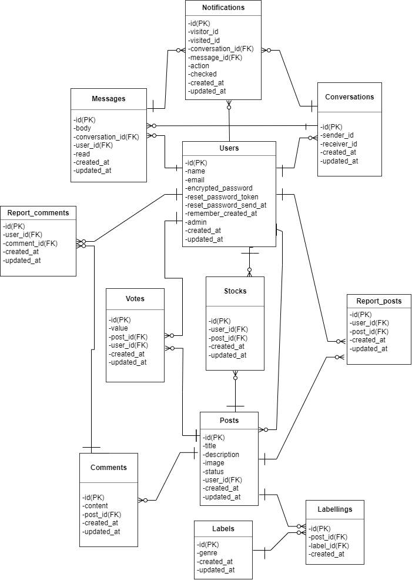
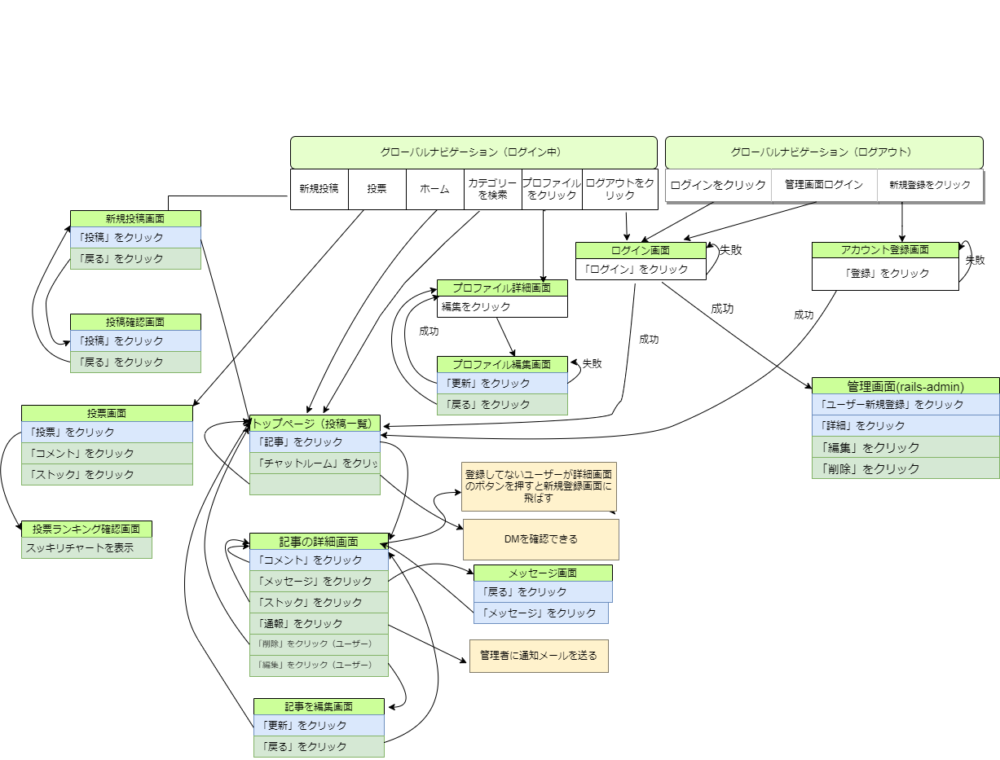

# README
【アプリケーション名】KIRAIBAR
公開URL: 未完成
# 開発言語

- Ruby　3.0.1
- Rails 6.0.3
- jQuery 3.5.1

# 主な使用Gem

* devise
* rails_admin
* carrier_wave
* kaminari
* cancancan

# 就業Termの技術
* devise
* Ajaxコメント機能
* メッセージ機能
* お気に入り機能
# カリキュラム以外の技術

* chartkick
# 実行手順
```
　git clone git@github.com:beni426/graduation-project.git  
  cd graduation-project  
  bundle install  
  rails db:create && rails db:migrate  
  rails s 
  ``` 
# カタログ設計
[カタログ設計](https://docs.google.com/spreadsheets/d/1nJV5vUM4nlcuy_dHZL-Nm0faMpxgfZPWz8KifM2saCs/edit?usp=sharing)

# テーブル定義
[テーブル定義](https://docs.google.com/spreadsheets/d/1nJV5vUM4nlcuy_dHZL-Nm0faMpxgfZPWz8KifM2saCs/edit?usp=sharing)

# ワイヤーフレーム
[ワイヤーフレーム.pdf](https://github.com/beni426/graduation-project/files/8569130/default.pdf)

# 卒業課題ER図
[卒業課題ER図.pdf](https://github.com/beni426/graduation-project/files/8371272/ER.pdf)


# 卒業課題画面遷移図

[卒業課題画面遷移図.pdf](https://github.com/beni426/graduation-project/files/8694262/default.pdf)



